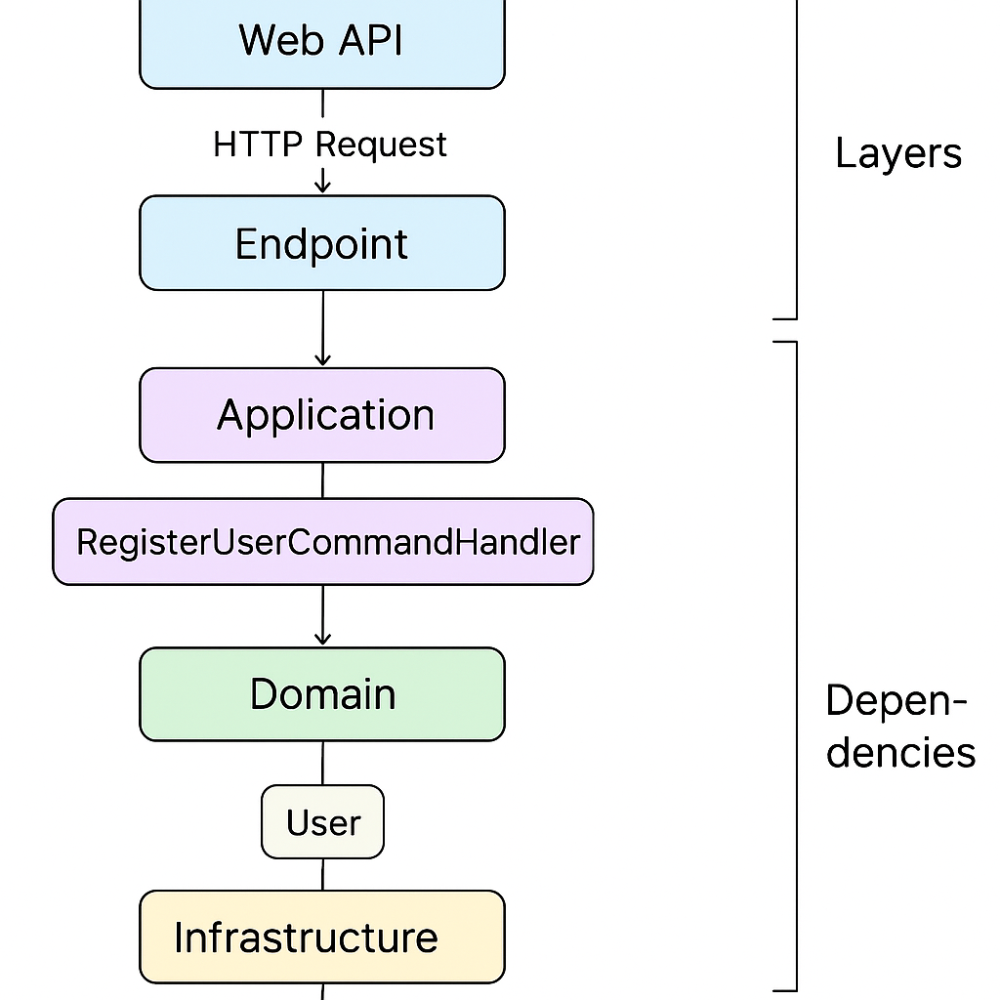

# CleanArchitecture

This README is a concise onboarding guide for the `CleanArchitecture` solution you uploaded. It contains build/run instructions, environment variables, quick troubleshooting notes, and a small visual architecture diagram (Mermaid).

---

## Overview
This solution follows a Clean Architecture style with the following projects under `src/`:

- `Web.Api` — Presentation layer (Minimal API endpoints + swagger + Serilog)
- `Infrastructure` — Implementations (EF Core DbContext, JWT auth, domain events, external services)
- `Application` — Application layer (commands, queries, handlers, validators, decorators)
- `Domain` — Domain model (entities, domain events, value objects)
- `SharedKernel` — small cross-cutting primitives (Result, Error, Entity base)
- `tests/ArchitectureTests` — rules to enforce architecture boundaries

The typical runtime flow is: **HTTP → Endpoint → Command/Query → Handler → Domain → Infrastructure (DB, external)**.

---

## Quick start (local)
> Tested workflow to build and run the API locally.

1. **Restore packages**

```bash
dotnet restore
```

2. **Build the solution**

```bash
dotnet build
```

3. **Configure the database connection**

- The application expects a connection string named `Database` in configuration (see `appsettings.json`).
- You can provide it via `appsettings.Development.json` or environment variable.

Example environment variable for PowerShell / Bash:

```bash
# Linux/Mac
export ConnectionStrings__Database="Server=localhost;Database=CleanArchDb;User Id=sa;Password=YourStrong!Pass;MultipleActiveResultSets=true"

# Windows PowerShell
$env:ConnectionStrings__Database = 'Server=localhost;Database=CleanArchDb;User Id=sa;Password=YourStrong!Pass;MultipleActiveResultSets=true'
```

> If you don't have SQL Server available, switch the EF Core provider to `InMemory` in `Infrastructure/DependencyInjection` for local dev/testing.

4. **Run the API**

```bash
cd src/Web.Api
dotnet run
```

- By default the server will start on the ASP.NET Core assigned URL (check console). Swagger UI is usually available at `/swagger`.

5. **Run tests**

```bash
cd <repo-root>
dotnet test
```

---

## Recommended `appsettings.json` snippet
Place this in `src/Web.Api/appsettings.Development.json` or set the values via env vars.

```json
{
  "ConnectionStrings": {
    "Database": "Server=localhost;Database=CleanArchDb;User Id=sa;Password=YourStrong!Pass;MultipleActiveResultSets=true"
  },
  "Jwt": {
    "Issuer": "CleanArchIssuer",
    "Audience": "CleanArchAudience",
    "Secret": "a-very-long-secret-key-change-this"
  }
}
```

> **Important:** Never commit production secrets to the repo. Use user secrets or a secure vault.

---

## Architecture Diagram



